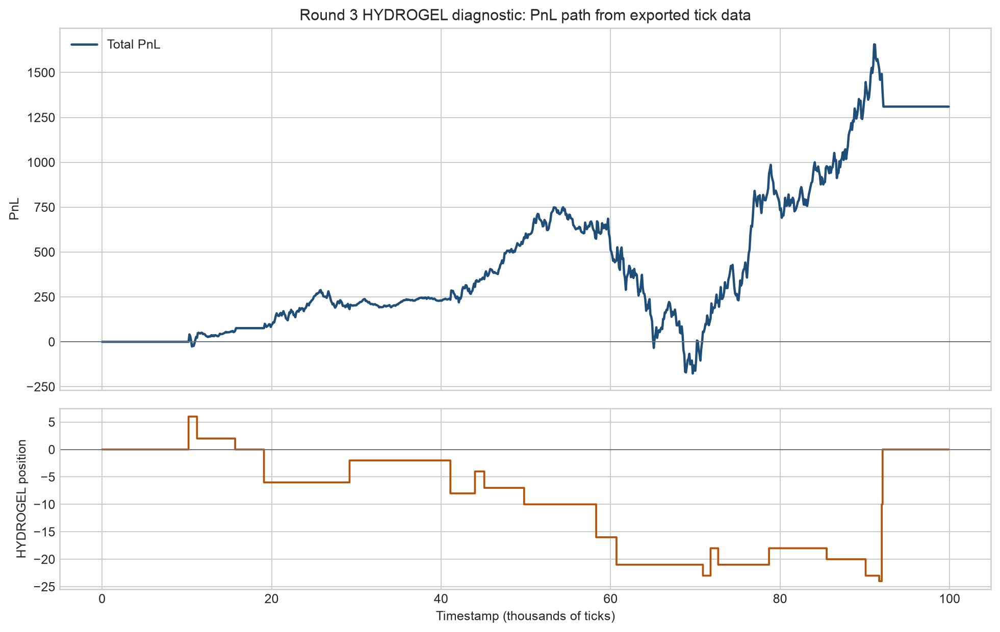
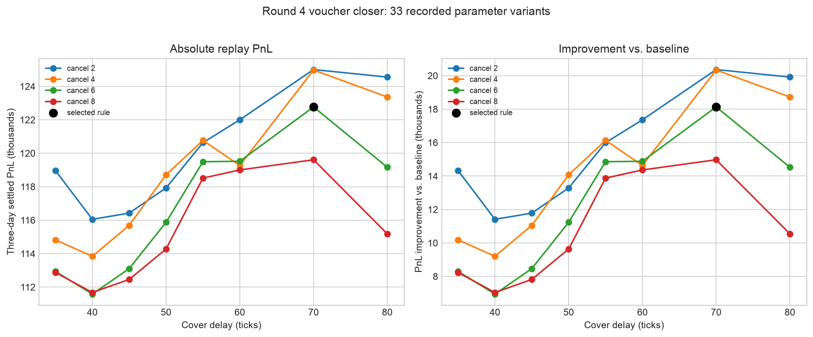

# IMC Prosperity 4: Trading Research Notes

I competed in IMC Prosperity 4 with Epic Furry. The research and implementation in this repository were my individual work. Our final entry placed #832 with a PnL of 246,105.91 XIRCs. I value the research process more than that result. This project taught me how easily a plausible trading idea can fail once execution and risk are measured honestly.

I focused on three questions in every round:

1. What does the market data say about each product?
2. Which strategy follows from that evidence?
3. What does the backtest prove wrong, and how should the strategy change?

These notes focus on Rounds 3 to 5. Rounds 1 and 2 were earlier exploration rounds.

The final notes for each round are here:

- [Round 3: Stable fair value and selective voucher trading](ROUND3_FINAL_STRATEGY.md)
- [Round 4: Full-day inventory and settlement risk](ROUND4_FINAL_STRATEGY.md)
- [Round 5: Execution realism and portfolio robustness](ROUND5_FINAL_STRATEGY.md)

The final code archive is available here:

- [Round 3 and Round 4 source archive](code/README.md)
- The Round 5 final source, `trader_r5_v7_18_submit.py`, was corrupted and cannot be uploaded.

## Research Approach

I started with the order book before I built a signal. I looked at mid prices, depth, spreads, trades around the mid, short-horizon returns, inventory paths, and daily PnL. For related products, I also checked whether they moved together or created the same risk under different names.

I did not assume that a signal was useful just because it looked good in a chart. A signal also had to survive the spread, the position limit, the fill model, and different trading days.

### Why I Used Wall-Mid

Inspired by the 2nd team in Prosperity 3. The best bid and best ask can move because of very small orders. This made the raw mid-price noisy in the Round 3 and Round 4 data. I therefore compared it with a `wall-mid`: the average of price levels that held meaningful displayed depth.

I used wall-mid mainly for `HYDROGEL_PACK`. For `VELVETFRUIT_EXTRACT`, it was a more stable fair-value anchor. In both cases, it helped separate a short-lived quote change from a change in the broader order book. I used it as a fair-value reference, not as a prediction that every price would revert immediately.

This was an important distinction. A stable fair-value estimate can still lose money when the strategy fills too early, holds too much inventory, or assumes an unrealistic fill rate.

## Round 3

### 1. Data and Market Interpretation

Round 3 contained `HYDROGEL_PACK`, `VELVETFRUIT_EXTRACT`, and call vouchers on VELVET.

`HYDROGEL_PACK` traded around a stable level, but it was not fixed at 10,000. Its spread was wide and its best quotes bounced often. The wall-mid was a better reference than the raw mid.

`VELVETFRUIT_EXTRACT` was more liquid and mean-reverted more cleanly. It also had periods of directional drift. This made it a useful trading product, but a risky one to hold at a large fixed inventory.

The vouchers looked attractive under an implied-volatility model. The trade data changed my view. Many apparent pricing gaps were smaller than the spread. Some strikes had too little trading activity. The more useful observation was that certain vouchers could be sold at rich prices and later covered when the underlying inventory cycle reversed.

### 2. Strategy Choice

I used wall-mid or outer-book fair value for the two underlying products. The strategy bought or sold only when the displayed price was sufficiently far from that reference. It also used inventory controls to avoid treating every deviation as a large directional signal.

For vouchers, I used a small and selective short-premium overlay. It was tied to the VELVET position cycle. The strategy covered the voucher position when the underlying moved back toward fair value. This was more realistic than trying to trade every theoretical volatility residual.

### 3. Backtest Findings and Revisions

The first major revision was to reject a simple option-pricing story. A theoretical residual was not enough after bid-ask costs and limited fills.

I also corrected the time-to-expiry mapping and used empirical relationships between the vouchers and VELVET instead of relying only on textbook delta. These checks made the strategy smaller and more selective. The final Round 3 approach was a stable fair-value strategy with a limited voucher overlay, not a broad volatility-arbitrage book.

One HYDROGEL-only live test ended at +1,310. The fills looked reasonable, but the PnL path was uncomfortable when a short inventory met a rally. That was a useful warning: good entry prices did not justify a larger position limit.

## Round 4

### 1. Data and Market Interpretation

Round 4 used the same underlying products and vouchers, but it added trader identifiers and another day of data. I used the identifiers as context rather than as a direct signal. A trader who appeared informative on one day was often not predictive on another.

The more important discovery came from full-day replay. The first part of the day did not represent the rest of the session. VELVET drift, voucher inventory, and settlement value could all change later in the day.

`HYDROGEL_PACK` remained relatively independent from the VELVET and voucher book. `VELVETFRUIT_EXTRACT` remained the core inventory product. Near-the-money and moderately out-of-the-money vouchers had more usable premium flow than deep in-the-money or floor-priced strikes.

### 2. Strategy Choice

I kept HYDROGEL as a conservative wall-mid strategy. I used VELVET as the main inventory engine and widened its entry threshold after the opening period.

I used voucher positions to express rich premium and to manage the VELVET inventory cycle. I kept the strategy selective by strike. I did not treat all vouchers as interchangeable. Trader identifiers were only small filters. They did not trigger trades by themselves.

### 3. Backtest Findings and Revisions

Round 4 overturned two intuitive ideas. First, early-session profit did not scale into full-day profit. Second, a forced end-of-day flatten or generic trailing stop reduced drawdown but often removed the later reversion or settlement value that the strategy needed.

I moved from a single headline PnL number to full-day, per-product, drawdown, and stress comparisons. The final version was a balanced inventory-and-premium strategy. It gave up some raw backtest profit to reduce concentration in late voucher positions.

This choice was concrete. The maximum-return candidate produced 201,436 over three days. The balanced version produced 198,916, a difference of 2,520. Under the stress +200 test, however, the balanced version produced 43,716 versus 34,236. I accepted the smaller headline result because the stress result improved by 9,480.

## Round 5

### 1. Data and Market Interpretation

Round 5 had a much larger product universe. Every product had a position limit of 10. I grouped products by family and measured daily drift, intraday direction, volatility, spread, trade frequency, and drawdown.

The live logs were especially important. They showed that many real fills occurred when an inside quote was hit by a market trade. A backtester that waited for the best quote to cross the limit price missed this behavior. At the same time, the logs showed that deep quotes did not receive the optimistic fills predicted by an early event model.

The data also showed that cross-day direction labels could fail within a day. A product could have a higher daily average price but still fall for most of the session. This was the main explanation for the weaker Round 5 day-four results.

### 2. Strategy Choice

I built a cap-safe directional book for products with stable evidence across days. Quotes were placed inside the spread only where the live fill mechanism supported it.

I used family-level controls for related risks. The PEBBLES basket had a useful price identity, but its short-lived deviations were too fast to support a large standalone mean-reversion strategy. It became a small, cap-safe overlay rather than the main source of return.

I added narrow risk gates where the data supported them. For example, `MICROCHIP_SQUARE` was disabled only when an early relative-price move resembled the day-four reversal pattern. I did not remove every product with one bad day.

### 3. Backtest Findings and Revisions

Round 5 forced the largest changes to my research process. The original backtester used an unrealistic fill rule. It also exposed an order-limit bug in the PEBBLES overlay. Both issues made early results unreliable.

One live log contained 131 submission fills. The median product fill rate was about 5 fills per 1,000 ticks. The old BBO-cross replay produced about 1. A market-trade event model replayed about 120 fills, which was much closer. I then found eight PEBBLES order-limit rejections: five in `PEBBLES_XL` and three in `PEBBLES_XS`. The overlay had reused capacity that the base order had already consumed.

I replaced the fill logic with a trade-driven model and then made it stricter for non-inside quotes. I added per-tick order reservation so base orders and overlays could not exceed the limit together. The corrected model returned zero simulated rejections. I then evaluated each module by day, drawdown, and live-log fit rather than by total PnL alone.

This process overturned several earlier conclusions. More products did not automatically create a better portfolio. Symmetric market making was not a default expansion path. A high backtest return from a product with poor live fills was not credible. The final Round 5 strategy favored fewer validated modules and targeted tail-risk controls.

## Main Lessons

- A market signal must be executable, not only statistically visible.
- A fill model is part of the strategy. If it is wrong, the backtest is wrong.
- Product-level returns can hide family-level risk.
- A good strategy should be evaluated across days and market regimes, not by one strong result.
- Risk controls should address a diagnosed failure mode. Broad defensive rules can remove the alpha as well as the risk.

## Reproducible Figures

The figures below are generated by [prosperity_replay_figures.ipynb](notebooks/prosperity_replay_figures.ipynb). The notebook reads saved CSV exports in [data](data). It does not enter PnL values by hand.

The first figure uses 1,000 exported Round 3 tick observations. It shows both PnL and HYDROGEL inventory. The position becomes increasingly short before the recovery. This is why I treated the strategy as a diagnostic and did not simply increase its cap.

The second figure contains 33 recorded Round 4 voucher-cover variants. The black point marks the selected `delay70_cancel6` rule. It was not the highest-PnL point. It was the version that passed the complete daily, drawdown, and stress checks.

The notebook also produces a [Round 4 cumulative replay figure](assets/research/r4_cumulative_replay.png) from the full-day results. Round 5 is intentionally absent from the notebook because the recovered archive does not include its final source or raw event-backtest CSVs.
